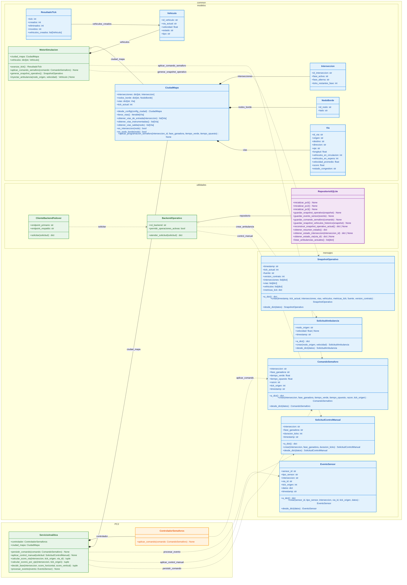
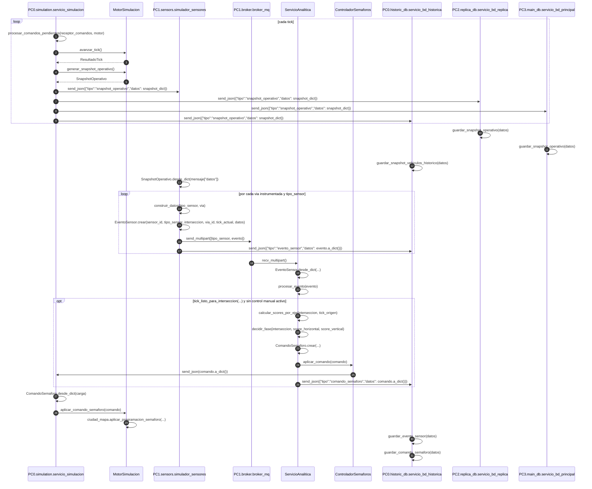
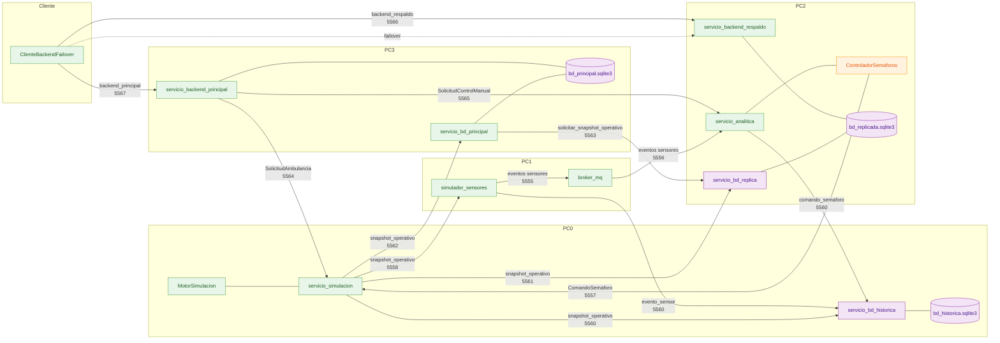
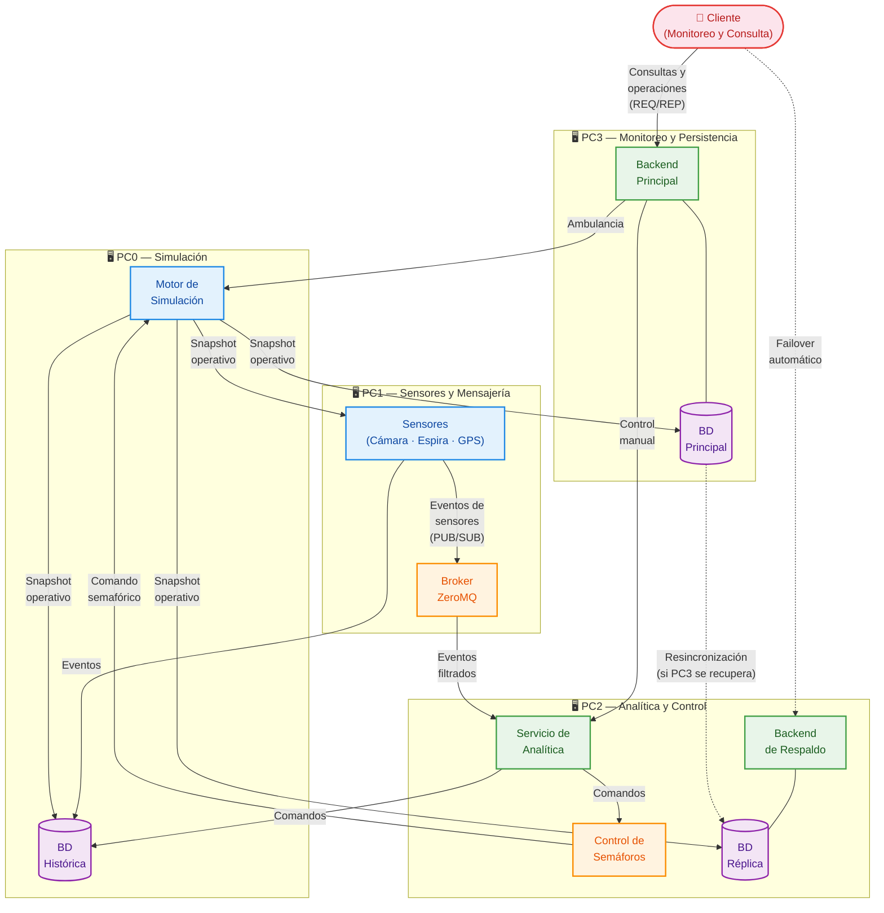

# Diagramas Mermaid

## 1. Diagrama de clases

### Explicación del diagrama de clases

El diagrama de clases resume las principales estructuras de datos compartidas del sistema, incluyendo los modelos de la ciudad, los mensajes intercambiados entre procesos y las utilidades de soporte. Permite visualizar qué información mantiene cada entidad y cómo se relacionan entre sí para soportar la simulación, la analítica y el backend operativo.

## 2. Diagrama de secuencia

### Explicación del diagrama de secuencia

El diagrama de secuencia muestra el flujo temporal de mensajes entre los procesos distribuidos durante un ciclo de simulación: desde la generación de snapshots en PC0, pasando por la publicación de eventos de sensores y su procesamiento en analítica, hasta la emisión de comandos de semáforos y la persistencia de datos en las distintas bases.

## 3. Diagrama de despliegue

### Explicación de nodos y conexiones

1. **PC0**: maneja la vida de los vehículos en la simulación. Actualiza el mapa, guarda su histórico propio y comunica el estado actual de los vehículos a PC3 y a la réplica operativa de PC2.
2. **PC1**: ejecuta los sensores lógicos sobre las aristas y publica sus eventos vía `PUB/SUB` al broker ZeroMQ. El broker es la puerta de entrada de los eventos hacia el resto del sistema.
3. **PC2**: actúa como el cerebro de control. Escucha los eventos, calcula los scores por vía, revisa los conflictos de cada intersección, controla los semáforos y mantiene la réplica operativa del estado actual. No guarda histórico de largo plazo.
4. **PC3**: expone las interfaces al usuario, contiene la base de datos principal y gestiona el reloj global. Si cae, la operación pasa a PC2. Cuando PC3 vuelve, su base se resincroniza con PC2 y la operación regresa automáticamente a PC3.

## 4. Diagrama de componentes

### Explicación del diagrama de componentes

El diagrama de componentes ofrece una vista conceptual de alto nivel del sistema, sin referencias a código ni clases. Cada nodo representa un componente lógico y cada flecha una interacción clave:

1. **PC0 (Simulación)**: el motor de simulación es la fuente autoritativa del estado del mundo. Cada tick genera un *snapshot operativo* que propaga a los demás computadores, y recibe comandos semafóricos de vuelta desde PC2.
2. **PC1 (Sensores y Mensajería)**: los sensores observan el estado de las vías a partir del snapshot y publican eventos al broker ZeroMQ mediante PUB/SUB. El broker desacopla productores y consumidores.
3. **PC2 (Analítica y Control)**: la analítica consume los eventos filtrados por el broker, calcula scores de congestión por vía y emite comandos al controlador de semáforos. Además, mantiene la base de datos réplica y un backend de respaldo que se activa automáticamente si PC3 cae.
4. **PC3 (Monitoreo y Persistencia)**: el backend principal atiende las consultas y operaciones del usuario (ambulancias, control manual, consultas históricas) mediante REQ/REP. Accede a la base de datos principal, que se resincroniza con la réplica de PC2 cuando PC3 se recupera de una caída.
5. **Cliente**: el usuario interactúa exclusivamente a través del backend. Un mecanismo de *failover* transparente redirige las peticiones al backend de respaldo en PC2 si el primario no responde.
